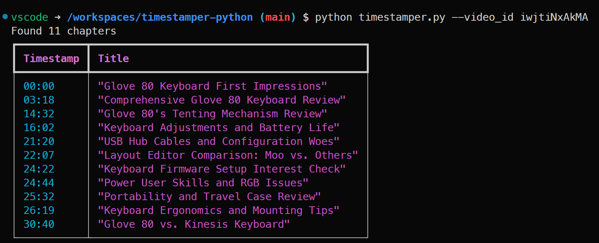

# Timestamper Python

Timestamper is a Python CLI tool that generates YouTube timestamps for a video based on a video ID.



## Pre-requisites

- Python 3.6 or higher
- Azure OpenAI API key

## Running the script

1. Clone the repository
2. Install the dependencies using `pip install -r requirements.txt`
3. Set your environment variables in a `.env` file
    ```
    OPENAI_API_KEY=YOUR_API_KEY  
    ENDPOINT=YOUR_ENDPOINT
    DEPLOYMENT_NAME=YOUR_DEPLOYMENT_NAME
    ```
4. Run the script using `python timestamper.py --video_id {video_id}`

## Contributing

Pull requests are welcome. For major changes, please open an issue first to discuss what you would like to change.

## License

[MIT](https://choosealicense.com/licenses/mit/)

## Future Improvements

- Improve grouping of captions

## Resources

- [Azure OpenAI API](https://www.microsoft.com/en-us/azure/openai)
- [Azure OpenAI On Your Data API Reference](https://learn.microsoft.com/en-us/azure/ai-services/openai/references/on-your-data?tabs=python)

- [OpenAI Python API library](https://github.com/openai/openai-python/blob/main/README.md)

https://www.youtube.com/live/qSpey7ef328